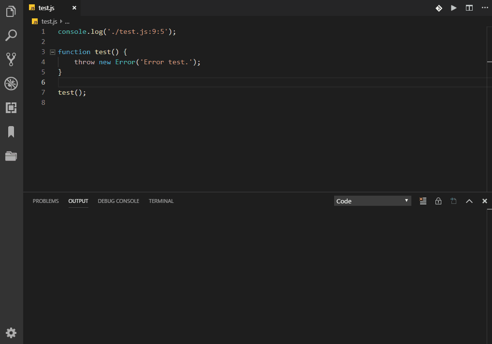

# Output Link to File

[](https://marketplace.visualstudio.com/items?itemName=93akkord.output-link-to-file)


[](https://travis-ci.com/93Akkord/vscode-output-link-to-file)

Turns file path urls in the output window into links.  Works well with the [Code Runner](https://marketplace.visualstudio.com/items?itemName=formulahendry.code-runner) extension when displaying the output in the output channel.

## Usage



## Configuration

Add or remove language ids from `output-link-to-file.languagesIds`.  Language ids listed here will have file links created for them.

```json
{
    "output-link-to-file.languagesIds": [
        "output-link-to-file",
        "log",
        "Log",
        "code-runner-output"
    ]
}
```
## Commands

`Output Unknown Language Ids`: This command can be accessed from the command palette.  It will display a list of unknown language ids in the output window.  This is useful when another extension might have change the language id of the output window.

